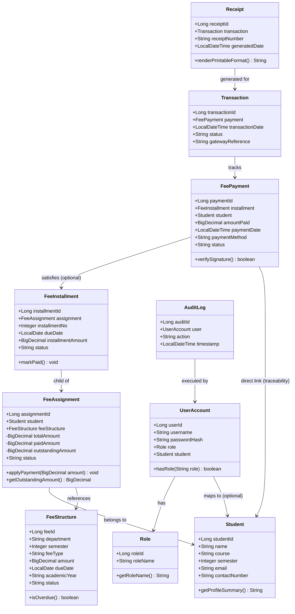

# Object-Oriented Domain Model & Class Diagram

## OOP Principles Demonstrated in Code
1. **Encapsulation:**
   - In `FeeAssignment`, financial amounts (`totalAmount`, `paidAmount`, `outstandingAmount`) are `private`. Direct setter modification is prohibited. Updates are strictly mediated via the business method `applyPayment(BigDecimal amount)`, ensuring invariants (`paidAmount + outstandingAmount == totalAmount`) are preserved.
2. **Polymorphism:**
   - Flexible reporting pipeline where report exporters implement a common `ReportGenerator` interface supporting both `JsonReportGenerator` and `CsvReportGenerator`.
3. **Single Responsibility Principle (SRP):**
   - Distinct service boundaries separating Authentication (`AuthService`), Student Profile (`StudentService`), Payment Processing (`PaymentService`), and Concurrency Control.
