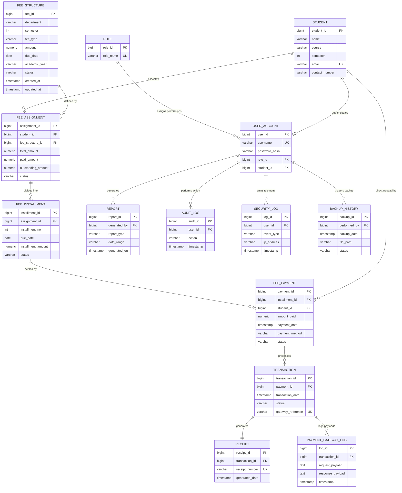

# Entity-Relationship (ER) Diagram
## SRS Section 10 Normalized 14-Table Architecture

### Architectural Notes for Database Viva
1. **Normalization:** The schema satisfies Third Normal Form (3NF). Every non-key attribute depends strictly on the primary key, the whole key, and nothing but the key.
2. **Double Foreign Key Design Pattern:** `FeePayment` deliberately preserves a foreign key to `Student` alongside `installment_id`. If an installment record is modified or payment happens on a full fee without installments, the payment record is permanently bound to the student, satisfying the non-repudiation requirement in financial systems without join performance penalties.
3. **Idempotency Key:** `Transaction.gateway_reference` is designated `UNIQUE`, preventing duplicate double-click transactions at the database engine level.
