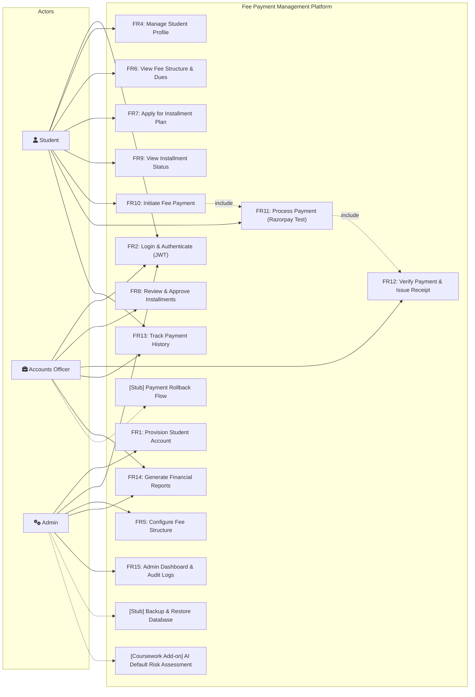

# System Use Case Specifications & Diagram

## Detailed Use Case Summaries

### Use Case 1: UC-PAY (FR10 - FR12 Payment Lifecycle)
- **Primary Actor:** Student
- **Supporting Actors:** Accounts Officer, Payment Gateway (Razorpay Simulator)
- **Preconditions:** Student is logged in; has an outstanding balance on `FeeAssignment` or a pending `FeeInstallment`.
- **Main Flow:**
  1. Student selects pending fee item and clicks "Pay Now".
  2. System acquires a **Pessimistic Write Lock (`SELECT ... FOR UPDATE`)** on `FeeAssignment`.
  3. System initializes a `FeePayment` record (`INITIATED`) and creates gateway order.
  4. Student confirms payment via Razorpay Test checkout interface.
  5. Gateway callback returns signature & payment ID (`gateway_reference`).
  6. System verifies cryptographic signature.
  7. System updates `FeePayment` to `SUCCESS`, reduces `outstanding_amount`, records `Transaction`, and generates sequential `Receipt`.
  8. Receipt is rendered for student view and download.
- **Postconditions:** `outstanding_amount` updated atomically; student ledger refreshed; immutable audit log recorded.
